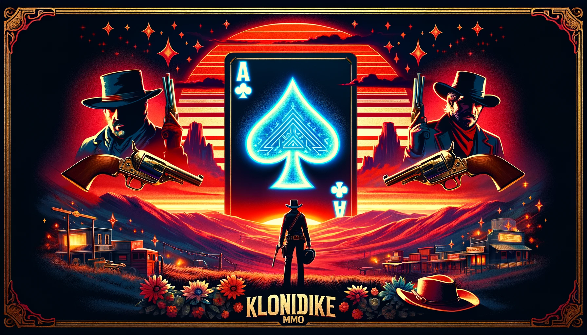

# Klondike MMO

Welcome to Klondike MMO, a multiplayer online version of the classic
Klondike solitaire card game!

This repository contains all the code and assets for the game.

## Play online

[Play Klondike MMO online!](https://www.klondikemmo.com/)

## Overview

Klondike MMO brings the timeless solitaire experience into the world of
multiplayer gaming. Play with friends or compete against players
from around the globe as you race to clear the tableau and build foundation piles.

## Features

- **Multiplayer Experience**: Enjoy Klondike solitaire
  with friends or strangers in real-time multiplayer matches.
- **Room-Local User IDs**: By default, users have room-local
  user IDs that change with each room refresh.
- **Global User IDs (Subscription)**: Players can purchase
  a subscription to unlock global user IDs for consistent identity
  across all game rooms.
- **Customizable Decks**: Personalize your gaming experience
  with a variety of customizable card decks and backgrounds.
- **Leaderboards and Achievements**: Compete for the top spot
  on global leaderboards and unlock achievements as you master the game.
- **In-Game Chat**: Communicate with other players
  through built-in chat functionality.
- **Regular Updates**: Stay tuned for regular updates,
  bug fixes, and new features to enhance your gaming experience.

## Contributing

We welcome contributions from the community to help improve Klondike MMO.
If you'd like to contribute, please follow these guidelines:

1. Fork the repository and create a new branch for your feature or bug fix.
2. Make your changes and ensure they adhere to the project's coding standards.
3. Test your changes thoroughly to ensure they work as expected.
4. Submit a pull request with a clear description of your changes and any relevant information.

## Support

If you encounter any issues while using Klondike MMO, please
[open a new issue](https://github.com/ctsrc/cardgame/issues) on GitHub.
We'll do our best to address the problem as quickly as possible.

## License

This project is licensed under the [ISC License](LICENSE),
which means you're free to use, modify, and distribute the code
as long as you include the appropriate license text.

## Acknowledgements

Submit a notable pull request and your name could appear here :)
